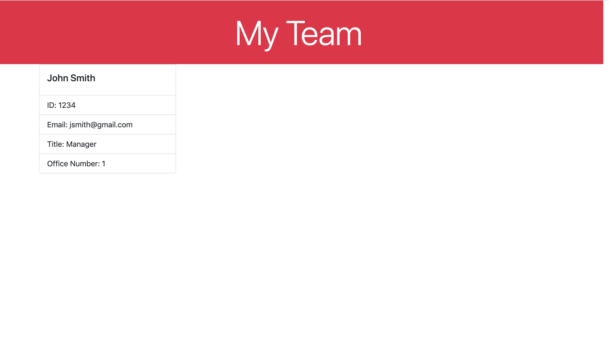

# Week10HW

This is my Week 10 homework. For this homework we had to creat a command line application using Node.js to generate an HTML webpage. We also had to create tests for our code. 

[hosted-url](https://avmancillas.github.io/Week10HW/)